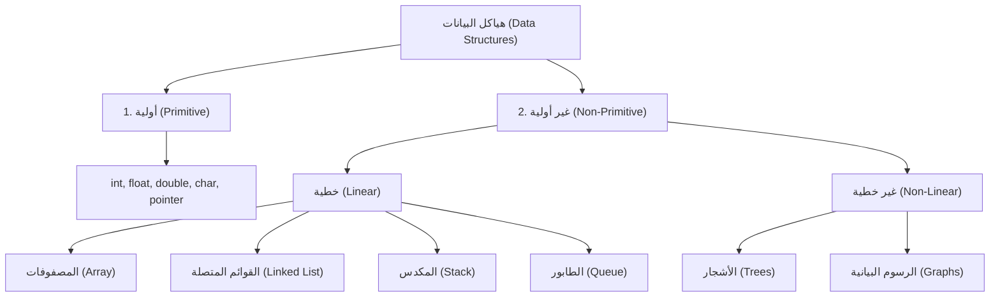

# 📘 ملخص اليوم الأول: مقدمة هياكل البيانات، تحليل التعقيد (Big-O)، والمكدس (Stack)

[](https://isocpp.org/)
[]()
[]()

---

## 📑 فهرس المحتويات
1. [ما هي هياكل البيانات؟ (Data Structures)](#1-ما-هي-هياكل-البيانات-data-structures)
2. [تصنيف هياكل البيانات (Classification)](#2-تصنيف-هياكل-البيانات-classification)
3. [المصفوفات مقابل القوائم المتصلة (Array vs Linked List)](#3-المصفوفات-مقابل-القوائم-المتصلة-array-vs-linked-list)
4. [تحليل التعقيد البرمجي (Complexity Analysis)](#4-تحليل-التعقيد-البرمجي-complexity-analysis)
5. [حالات قياس الأداء ورموزها (Best, Average, Worst)](#5-حالات-قياس-الأداء-ورموزها-best-average-worst)
6. [دليلك العملي: كيف تحسب الـ Big-O؟ (أمثلة كود مفصلة)](#6-دليلك-العملي-كيف-تحسب-الـ-big-o-أمثلة-كود-مفصلة)
7. [سلم سرعات الخوارزميات (Big-O Hierarchy)](#7-سلم-سرعات-الخوارزميات-big-o-hierarchy)
8. [هيكل بيانات المكدس (Stack ADT)](#8-هيكل-بيانات-المكدس-stack-adt)
9. [تطبيقات واقعية على الـ Stack](#9-تطبيقات-واقعية-على-الـ-stack)
10. [تشريح دوال الـ Stack والحالات الحرجة (Overflow & Underflow)](#10-تشريح-دوال-الـ-stack-والحالات-الحرجة-overflow--underflow)
11. [الكود الكامل لبناء الـ Stack في C++ (Array-Based with Templates)](#11-الكود-الكامل-لبناء-الـ-stack-في-c-array-based-with-templates)

---

## 1. ما هي هياكل البيانات؟ (Data Structures)
**هيكل البيانات** هو أسلوب متخصص لتنظيم، إدارة، وتخزين البيانات في ذاكرة الحاسوب:
> 💡 **المصطلح الإنجليزي:** `Data Organization, Management, and Storage Format`

الهدف الأساسي منها هو تمكين البرنامج من تنفيذ العمليات البرمجية بأقصى سرعة وأقل استهلاك لمساحة الذاكرة.

### ⚙️ العمليات الأساسية الأربعة على أي هيكل بيانات:

| العملية بالعربي | المصطلح الإنجليزي | الوصف البرمجي |
| :--- | :--- | :--- |
| **الوصول** | `Access` | قراءة أو تعديل عنصر في موضع محدد ومعروف مباشرة. |
| **البحث** | `Search` | فحص البيانات للوصول إلى موضع عنصر بمعلومية قيمته. |
| **الإضافة** | `Insertion` | حجز مكان لعنصر جديد (في البداية، المنتصف، أو النهاية). |
| **الحذف** | `Deletion` | إزالة عنصر من الهيكل وتحرير مساحته من الذاكرة. |

---

## 2. تصنيف هياكل البيانات (Classification)

تنقسم هياكل البيانات إلى نوعين رئيسيين:

* **البيانات الأولية (Primitive):** أنواع أساسية مدمجة في لغة C++ ويتعامل معها المعالج مباشرة مثل: `int`, `float`, `double`, `char`, `pointer`.
* **البيانات غير الأولية (Non-Primitive):** تنقسم إلى قسمين:
  1. **خطية (Linear):** تترتب فيها العناصر بشكل متتابع متسلسل: `Array`, `Linked List`, `Stack`, `Queue`.
  2. **غير خطية (Non-Linear):** ترتبط فيها العناصر بنظام هرمي أو شبكي: `Trees`, `Graphs`.



---

## 3. المصفوفات مقابل القوائم المتصلة (Array vs Linked List)

### 💡 كيف تصل المصفوفة (`Array`) للعناصر بسرعة خارقة $O(1)$؟
المصفوفة تُحجز ككتلة واحدة متصلة في الذاكرة (`Contiguous Memory`).  
لذا المعالج لا يبحث عن العنصر خانة بخانة، بل يحسب عنوانه مباشرة بمعادلة الذاكرة في خطوة واحدة:

$$\text{Address} = \text{Base Address} + (\text{Index} \times \text{Size of Type})$$

* **مثال:** لو بداية المصفوفة عند العنوان `1000` ونوع البيانات `int` (حجمه 4 بايت):  
  $$\text{Address of arr[3]} = 1000 + (3 \times 4) = 1012$$  
  يقفز المعالج فوراً للعنوان `1012` في زمن ثابت فوري $O(1)$.

### ⚖️ جدول المقارنة الفنية:

| وجه المقارنة | المصفوفة (`Array`) | القائمة المتصلة (`Linked List`) |
| :--- | :--- | :--- |
| **الوصول المباشر (`Access`)** | سريع وفوري **$O(1)$** | بطيء **$O(n)$** (يجب البدء من أول عنصر) |
| **الإضافة في البداية (`Insert First`)** | بطيء $O(n)$ (يتطلب إزاحة لجميع العناصر) | فوري وسريع جداً **$O(1)$** |
| **الحجم في الذاكرة (`Memory Size`)** | ثابت ومحدد مسبقاً (`Fixed Size`) | ديناميكي يتمدد وينكمش حسب الحاجة |
| **استهلاك الذاكرة** | اقتصادي (تخزن البيانات فقط) | تستهلك مساحة إضافية لتخزين المؤشر `Pointer` |

---

## 4. تحليل التعقيد البرمجي (Complexity Analysis)
عند تقييم كفاءة أي كود أو خوارزمية (`Algorithm`)، نقيس بعدين أساسيين:
1. **التعقيد الزمني (`Time Complexity`):** معدل زيادة عدد الخطوات والعمليات التي ينفذها البرنامج مع تضخم حجم المدخلات ($n$).
2. **التعقيد المكاني (`Space Complexity`):** حجم الذاكرة الإضافية (`RAM`) التي يستهلكها البرنامج أثناء التشغيل.

---

## 5. حالات قياس الأداء ورموزها (Best, Average, Worst)

عند البحث عن قيمة داخل مصفوفة حجمها $n$:

| الحالة | المعنى الحسابي | الرمز الرياضي | الاسم الشائع |
| :--- | :--- | :---: | :--- |
| **أفضل حالة (`Best Case`)** | عندما نجد العنصر المطلوب في أول خانة فوراً. | **$\Omega(1)$** | **`Big-Omega`** |
| **متوسط الحالات (`Average Case`)** | عندما نجد العنصر المطلوب في منتصف البيانات تقريباً. | **$\Theta(n)$** | **`Big-Theta`** |
| **أسوأ حالة (`Worst Case`)** | عندما يكون العنصر في آخر خانة أو غير موجود تماماً. | **$O(n)$** | **`Big-O`** ⭐ |

> 🎯 **لماذا نعتمد دائماً على الـ `Big-O`؟**  
> لأننا نضمن أسوأ سيناريو محتمل لأداء البرنامج؛ فإذا كان الكود سريعاً ومقبولاً في أسوأ ظرف، فهو بالضرورة سيعمل بكفاءة في باقي الأوقات.

---

## 6. دليلك العملي: كيف تحسب الـ Big-O؟ (أمثلة كود مفصلة)

### 🔹 القاعدة الأولى: العمليات البسيطة تأخذ وقتاً ثابتاً $O(1)$
العمليات الحسابية، الشروط، وإسناد المتغيرات لا تتأثر بحجم المدخلات:

```cpp
// [Time: O(1)] - Basic operations & condition
int a = 10;
int b = 20;
int result = (a + b) * 2;  // عملية حسابية واحدة -> O(1)

if (result > 50) {          // فحص شرطي واحد     -> O(1)
    cout << "Valid";
}
```

### 🔹 القاعدة الثانية: اللوب البسيط يأخذ وقتاً خطياً $O(n)$
إذا كانت الحلقة تزيد بمقدار ثابت وتدور بعدد مرات المدخل $n$:

```cpp
// [Time: O(n)] - Linear loop
for (int i = 0; i < n; i++) {
    cout << i << "\n";
}
```

### 🔹 القاعدة الثالثة: الحلقات المتداخلة تأخذ $O(n^2)$
عند وجود حلقة داخل حلقة أخرى، نضرب عدد الدورات:

```cpp
// [Time: O(n^2)] - Nested loops (n * n)
for (int i = 0; i < n; i++) {
    for (int j = 0; j < n; j++) {
        cout << i << " " << j << "\n";
    }
}
```

### 🔹 القاعدة الرابعة: مضاعفة أو تنصيف العداد تأخذ $O(\log n)$
إذا كان العداد يتضاعف بالضرب (`i *= 2`) أو يقل للنصف بالقسمة (`i /= 2`):

```cpp
// [Time: O(log n)] - Multiplicative counter
for (int i = 1; i < n; i *= 2) {
    cout << i << "\n";
}
```

* **مثال توضيحي:** لو كانت $n = 64$، قيم $i$ ستكون: `1, 2, 4, 8, 16, 32` (أي 6 خطوات فقط لأن $\log_2(64) = 6$).

---

### 🔹 القاعدة الخامسة: إسقاط الثوابت والحدود الصغرى (`Drop Constants`)
في الحسابات، نهمل المعاملات الثابتة والحدود الضعيفة ونحتفظ فقط بالحد الأسرع نمواً:
* $f(n) = 4n^2 + 7n + 500 \implies \mathbf{O(n^2)}$
* $f(n) = 3n + 10000 \implies \mathbf{O(n)}$
* $f(n) = 99999 \implies \mathbf{O(1)}$

---

### 🔹 القاعدة السادسة: المقارنة الذهبية (اللوب مقابل المعادلة الرياضية)
لحساب مجموع الأرقام المتتالية من $1$ إلى $n$:

```cpp
// [Approach 1: O(n)] - حلقة دوران (Loop)
int sum = 0;
for (int i = 1; i <= n; i++) {
    sum += i;
}

// [Approach 2: O(1)] - قانون جاوس الرياضي المباشر
int sum = n * (n + 1) / 2;
```

* **المقارنة الواقعية:** إذا كانت $n = 1,000,000,000$ (مليار):
  * اللوب سيستغرق **عدة ثوانٍ** وقد يسبب `Time Limit Exceeded`.
  * المعادلة الرياضية ستُحسب فوراً في **أقل من 1 نانو ثانية** لأنها عملية ثابتة $O(1)$.

---

## 7. سلم سرعات الخوارزميات (Big-O Hierarchy)

| رمز التعقيد | الاسم الرياضي | تقييم الكفاءة | مثال شهير عليه |
| :---: | :--- | :---: | :--- |
| **$O(1)$** | `Constant Time` | 🟢 ممتاز جداً | قراءة عنصر في مصفوفة بالـ `Index` |
| **$O(\log n)$** | `Logarithmic Time` | 🟢 ممتاز | خوارزمية البحث الثنائي (`Binary Search`) |
| **$O(n)$** | `Linear Time` | 🟡 جيد | البحث الخطي (`Linear Search`) |
| **$O(n \log n)$** | `Linearithmic Time` | 🟡 مقبول جداً | خوارزميات الترتيب السريعة (`Merge Sort`, `Quick Sort`) |
| **$O(n^2)$** | `Quadratic Time` | 🟠 بطيء | الحلقات المتداخلة الثنائية (`Bubble Sort`) |
| **$O(2^n)$** | `Exponential Time` | 🔴 سيء جداً | متتالية فيبوناتشي بالاستدعاء الذاتي العادي |
| **$O(n!)$** | `Factorial Time` | ☠️ كارثي | تجربة جميع التباديل والاحتمالات الممكنة |

> ⚡ **سلم سرعات الخوارزميات (من الأسرع للأبطأ):**  
> `O(1)` < `O(log n)` < `O(n)` < `O(n log n)` < `O(n²)` < `O(2ⁿ)` < `O(n!)`

---

## 8. هيكل بيانات المكدس (Stack ADT)

الـ **Stack** هو هيكل بيانات خطي (`Linear Data Structure`) يتبع مبدأ:
> 🌟 **`LIFO`** = **Last In, First Out**  
> (العنصر الذي يدخل آخراً هو أول عنصر يخرج)

### 🏺 التشبيه البصري (وعاء الأطباق العمودي):
تخيل أن لديك وعاءً عمودياً مغلقاً من القاع وله فتحة علوية واحدة فقط:
1. أول طبق وضعته في القاع سيكون **آخر طبق يخرج**.
2. آخر طبق وضعته في القمة سيكون **أول طبق يخرج**.

```text
[Stack Visualization - مبدأ LIFO]
        +------+
        |  30  |  <--- Top (آخر عنصر دخل وأول عنصر يخرج)
        |  20  |
        |  10  |  <--- Bottom (أول عنصر دخل عند Index 0)
        +------+
```

### 📍 ما هو الـ `Top`؟
* الـ `Top` هو متغير مؤشر (فهرس `Index`) يشير دائماً إلى **آخر عنصر تمت إضافته للـ Stack** (العنصر الموجود في القمة حالياً).
* **القيمة الابتدائية:** يبدأ دائماً بـ **`-1`** دلالة على أن الـ Stack **فارغ تماماً** (`Empty`).
* عند إضافة أول عنصر: نزيد الـ `top` بمقدار 1 فيصبح `top = 0` (يشير لأول خانة في المصفوفة).

---

## 9. تطبيقات واقعية على الـ Stack

1. **خاصية التراجع (`Undo / Redo - Ctrl + Z`):** كل حركة تُسجل في Stack وتسترجع بـ `Pop`.
2. **زر الرجوع في المتصفحات (`Browser Back Button`):** الصفحات السابقة ترتب في Stack.
3. **تتبع الدوال واستدعاء الـ Recursion (`Call Stack`):** نظام التشغيل يضع الدوال النشطة في Stack.
4. **فحص الأقواس البرمجية (`Balanced Parentheses`):** التأكد من صحة إغلاق الأقواس `{ [ ( ) ] }`.

---

## 10. تشريح دوال الـ Stack والحالات الحرجة (Overflow & Underflow)

جميع عمليات الـ Stack الأساسية تعمل في زمن فوري ثابت **$O(1)$**:

* **فحص الفراغ (`isEmpty`):** فحص هل `top == -1`.
* **دالة الإضافة (`push`):** فحص `top >= MAX_SIZE - 1` لتفادي الـ **`Stack Overflow`**.
* **دالة الحذف البسيطة (`pop`):** إنقاص `top--` بعد فحص `isEmpty()` لتفادي الـ **`Stack Underflow`**.
* **دالة الحذف مع استرجاع القيمة (`pop by reference`):** تأخذ المتغير بالمرجع `t &element` لتخزن فيه العنصر المحذوف قبل إنقاص `top--`.
* **دالة قراءة القمة (`getTop by reference`):** وضع قيمة `item[top]` داخل المتغير الممرر بالمرجع.

```cpp
// 1. isEmpty(): فحص هل الستاك فارغ
bool isEmpty() {
    return top == -1;
}

// 2. push(val): دالة الإضافة مع الحماية من Overflow
void push(t element) {
    if (top >= MAX_SIZE - 1) {
        cout << "Stack Overflow" << endl;
        return;
    }
    top++;
    item[top] = element;
}

// 3. pop(): دالة الحذف العادية
void pop() {
    if (isEmpty()) {
        cout << "Stack Underflow" << endl;
        return;
    }
    top--;
}

// 4. pop(&element): دالة الحذف مع استرجاع القيمة بالـ Reference
void pop(t &element) {
    if (isEmpty()) {
        cout << "Stack Underflow" << endl;
        return;
    }
    element = item[top]; // حفظ العنصر قبل الحذف
    top--;
}

// 5. getTop(&element): دالة قراءة القمة بالـ Reference
void getTop(t &element) {
    if (isEmpty()) {
        cout << "Stack is empty" << endl;
        return;
    }
    element = item[top];
}
```

---

## 11. الكود الكامل لبناء الـ Stack في C++ (Array-Based with Templates)

تم بناء الكود بالـ **Templates** (`template <class t>`) ليعمل مع أي نوع بيانات (`int`, `double`, `string`, `char`):

```cpp
#include <iostream>

using namespace std;

const int MAX_SIZE = 100;

template <class t>
class Stack {
private:
    int top;
    t item[MAX_SIZE];

public:
    // Constructor: تهيئة مؤشر القمة بـ -1
    Stack() : top(-1) {}

    // 1. فحص هل الستاك فارغ
    bool isEmpty() {
        return top == -1;
    }

    // 2. إضافة عنصر جديد (مع فحص Overflow)
    void push(t element) {
        if (top >= MAX_SIZE - 1) {
            cout << "Stack Overflow" << endl;
            return;
        }
        top++;
        item[top] = element;
    }

    // 3. حذف العنصر الأعلى
    void pop() {
        if (isEmpty()) {
            cout << "Stack Underflow" << endl;
            return;
        }
        top--;
    }

    // 4. حذف العنصر الأعلى مع استرجاع قيمته
    void pop(t &element) {
        if (isEmpty()) {
            cout << "Stack Underflow" << endl;
            return;
        }
        element = item[top];
        top--;
    }

    // 5. قراءة العنصر في القمة
    void getTop(t &element) {
        if (isEmpty()) {
            cout << "Stack is empty" << endl;
            return;
        }
        element = item[top];
    }

    // 6. طباعة جميع العناصر من القمة للقاع
    void print() {
        if (isEmpty()) {
            cout << "Stack is empty" << endl;
            return;
        }
        for (int i = top; i >= 0; i--) {
            cout << item[i] << endl;
        }
    }
};

int main() {
    Stack<int> s;

    // تجربة الإضافة Push
    s.push(5);
    s.push(10);
    s.push(15);
    s.push(20);

    // قراءة القمة getTop
    int topElement;
    s.getTop(topElement);
    cout << "Top element: " << topElement << endl; // سيطبع 20

    // تجربة الحذف pop واسترجاع المحذوف
    s.pop(topElement);
    cout << "Popped element: " << topElement << endl; // سيطبع 20

    // طباعة باقي العناصر من القمة للقاع
    cout << "Remaining stack elements:" << endl;
    s.print(); // سيطبع: 15 ثم 10 ثم 5

    return 0;
}
```
